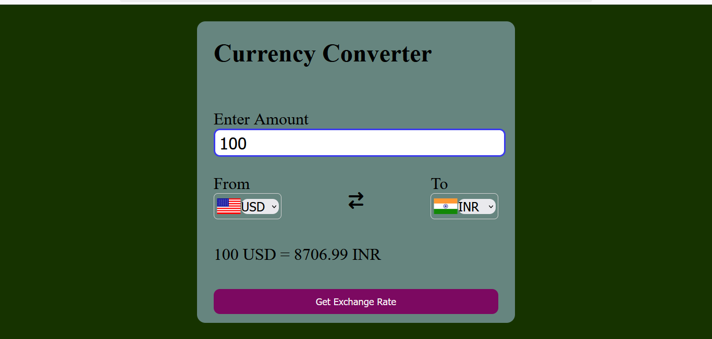

# 💱 Currency Exchange Tool

A simple and responsive currency converter web app built using **HTML**, **CSS**, and **JavaScript**. It fetches real-time exchange rates using a public API.

---

---

## 🌐 Live Demo

[Click here!](https://Kajal-Kumari1951.github.io/currency-exchange-tool/)

---

## 🔹 Features

- Real-time currency conversion
- Easy dropdown selection
- Clean and responsive UI
- Fast and lightweight

---

## 🚀 How to Run

1. Clone the repository or download the ZIP
2. Open `project3.html` in any browser
3. Enter amount, choose currencies, and convert!

---

## 📂 Files in This Project

- `project3.html` — Main HTML page
- `style.css` — Styling for UI
- `script.js` / `codes.js` — JavaScript logic
- `README.md` — Project documentation

---

## 🙋‍♀️ Author

**Kajal Kumari**  
Built with 💖 using Vanilla JS
